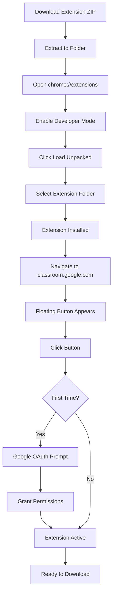
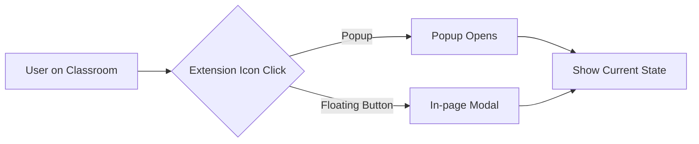
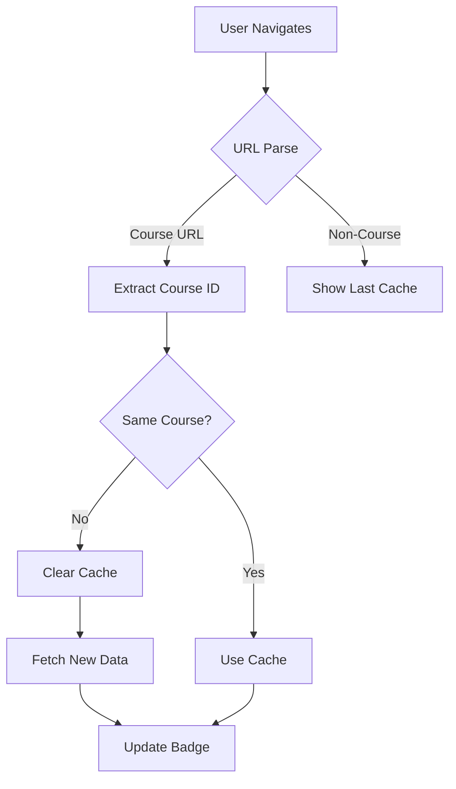
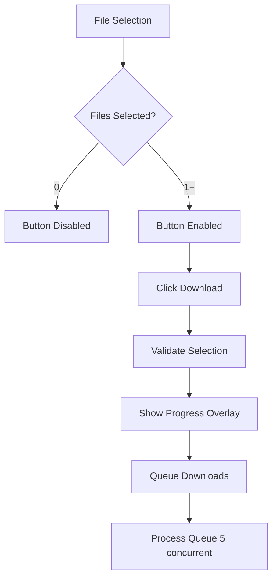
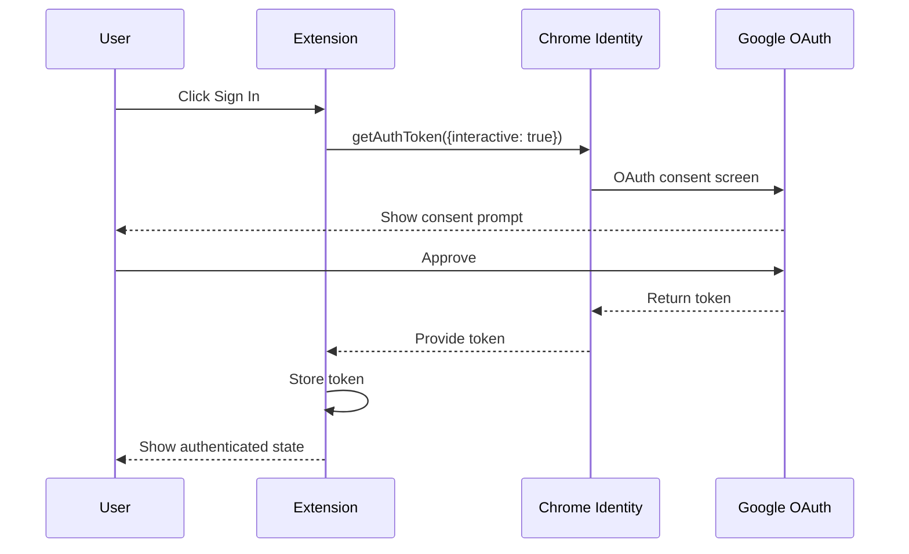

# ClassMate - Classroom Downloader
## Complete UI/UX Technical Documentation

**Document Version:** 2.0.0  
**Extension Version:** 1.0.1  
**Date:** December 2024  
**Status:** Production-Ready

---

## Table of Contents

1. [Project Overview and Context](#1-project-overview-and-context)
2. [Complete UI Analysis](#2-complete-ui-analysis)
3. [Interactive Elements](#3-interactive-elements)
4. [Content and Messaging](#4-content-and-messaging)
5. [User Experience Flow](#5-user-experience-flow)
6. [Functional Capabilities](#6-functional-capabilities)
7. [Accessibility and Standards Compliance](#7-accessibility-and-standards-compliance)
8. [Performance and Feedback Mechanisms](#8-performance-and-feedback-mechanisms)
9. [Edge Cases and Error Handling](#9-edge-cases-and-error-handling)
10. [Comprehensive Evaluation](#10-comprehensive-evaluation)

---

## 1. Project Overview and Context

### 1.1 Extension Identity

| Attribute | Value |
|-----------|-------|
| **Name** | ClassMate - Classroom Downloader |
| **Internal ID** | GCR Downloader |
| **Version** | 1.0.1 |
| **Manifest Version** | 3 (Chrome MV3) |
| **Category** | Productivity / Education |

### 1.2 Core Value Proposition

ClassMate is a browser extension that enables bulk downloading of all course materials from Google Classroom in a single operation. The extension streamlines the process of obtaining complete course materials efficiently, eliminating the need for manual, file-by-file downloads.

**Key Value Differentiators:**
- One-click bulk download functionality
- Automatic course detection and intelligent caching
- Multi-format support with intelligent conversion (Google Docs to PDF, Sheets to XLSX)
- Organized file structure mirroring course hierarchy
- Real-time progress tracking and resumable downloads

### 1.3 Target User Personas

#### Primary Persona: University Student
- **Demographics:** Age 18-25, undergraduate or postgraduate
- **Technical Proficiency:** Moderate to high
- **Pain Points:** Manual downloading is time-consuming; materials scattered across multiple courses
- **Usage Pattern:** Weekly bulk downloads before exams or study sessions

#### Secondary Persona: Educator/Instructor
- **Demographics:** Age 25-55, teaching staff
- **Technical Proficiency:** Moderate
- **Pain Points:** Need to backup course materials; sharing materials across platforms
- **Usage Pattern:** Periodic archival downloads at semester end

#### Tertiary Persona: Academic Administrator
- **Demographics:** Age 30-50, administrative staff
- **Technical Proficiency:** Low to moderate
- **Pain Points:** Compliance and record-keeping requirements
- **Usage Pattern:** Quarterly or annual archival downloads

### 1.4 Primary Use Case Scenarios

| Scenario | Description | User Action |
|----------|-------------|-------------|
| **Exam Preparation** | Student downloads all lecture slides before exams | Visit course, click download button, select all slides |
| **Offline Study** | Student needs materials without internet access | Bulk download all materials for offline access |
| **Course Archival** | End-of-semester backup of all course content | Select all files across all categories |
| **Selective Download** | Download only specific file types (PDFs, slides) | Use format filters to select specific types |
| **Material Verification** | Confirm all instructor materials are available | View file counts and categories before download |

### 1.5 Technical Environment

#### Browser Compatibility

| Browser | Status | Notes |
|---------|--------|-------|
| **Google Chrome** | Full Support | Primary target, all features functional |
| **Microsoft Edge** | Full Support | Chromium-based, identical functionality |
| **Brave Browser** | Partial Support | May require shield configuration |
| **Firefox** | Not Supported | Uses WebExtensions API (would require port) |
| **Safari** | Not Supported | Different extension architecture |

**Minimum Chrome Version:** 88 (Manifest V3 support)  
**Recommended Chrome Version:** 100+

#### System Requirements

- **Operating System:** Windows 10/11, macOS 10.15+, Linux (Ubuntu 20.04+, Fedora 34+)
- **RAM:** 4GB minimum (8GB recommended for large downloads)
- **Storage:** 100MB for extension, variable for downloads
- **Internet:** Broadband connection (10 Mbps+ recommended)

### 1.6 Installation and Activation Workflow



**Installation Steps:**

1. **Download:** Obtain extension package (ZIP or CRX file)
2. **Extract:** Unzip to permanent location (e.g., `Documents/Extensions/`)
3. **Access:** Navigate to `chrome://extensions/` in browser
4. **Enable:** Toggle "Developer mode" switch (top-right corner)
5. **Load:** Click "Load unpacked" button
6. **Select:** Choose extracted extension folder
7. **Verify:** Confirm extension appears in list with correct icon
8. **Activate:** Visit Google Classroom to trigger initialization
9. **Authenticate:** Complete Google OAuth consent flow (first use only)
10. **Ready:** Floating download button now active on all Classroom pages

---

## 2. Complete UI Analysis

### 2.1 Visual Design System

#### 2.1.1 Design Philosophy

The extension employs a **dark-mode-first, Gen-Z SaaS aesthetic** with the following core principles:

| Principle | Implementation |
|-----------|----------------|
| **Glassmorphism** | Semi-transparent backgrounds with blur effects |
| **Gradient Accents** | Multi-color gradients for primary actions |
| **Depth Hierarchy** | Layered elevation with shadow progression |
| **Microinteractions** | Smooth transitions and hover state feedback |
| **Space Efficiency** | Compact layouts optimized for popup dimensions |

#### 2.1.2 Color Palette

**Dark Mode (Default)**

| Token | Hex Code | Usage |
|-------|----------|-------|
| `--bg-primary` | `#0f172a` | Main background |
| `--bg-secondary` | `#1e293b` | Card backgrounds, inputs |
| `--bg-tertiary` | `#334155` | Elevated elements, hover states |
| `--bg-elevated` | `#475569` | Highest elevation surfaces |
| `--text-primary` | `#f1f5f9` | Headings, primary content |
| `--text-secondary` | `#94a3b8` | Body text, descriptions |
| `--text-muted` | `#64748b` | Placeholders, captions |

**Accent Colors**

| Token | Hex Code | Usage |
|-------|----------|-------|
| `--accent` | `#8b5cf6` | Primary interactive elements |
| `--accent-light` | `#a78bfa` | Hover states, highlights |
| `--accent-dark` | `#7c3aed` | Active states, pressed |
| `--accent-glow` | `rgba(139, 92, 246, 0.4)` | Button shadows, focus rings |
| `--accent-subtle` | `rgba(139, 92, 246, 0.1)` | Selection backgrounds |

**Status Colors**

| Token | Hex Code | Usage |
|-------|----------|-------|
| `--success` | `#10b981` | Completed downloads, success states |
| `--warning` | `#f59e0b` | Caution messages, partial success |
| `--danger` | `#ef4444` | Errors, destructive actions |
| `--info` | `#3b82f6` | Informational elements |

**File Type Colors**

| Token | Hex Code | File Type |
|-------|----------|-----------|
| `--color-pdf` | `#ef4444` | PDF documents |
| `--color-slides` | `#f59e0b` | Google Slides, PowerPoint |
| `--color-docs` | `#3b82f6` | Google Docs, Word documents |
| `--color-sheets` | `#22c55e` | Google Sheets, Excel |
| `--color-links` | `#8b5cf6` | External links, URLs |

**Gradients**

| Token | Value | Usage |
|-------|-------|-------|
| `--gradient-primary` | `linear-gradient(135deg, #667eea 0%, #764ba2 50%, #f953c6 100%)` | Primary buttons, key actions |
| `--gradient-header` | `linear-gradient(135deg, #1e1b4b 0%, #312e81 50%, #4c1d95 100%)` | Header background |

**Light Mode (Theme: Light)**

| Token | Hex Code |
|-------|----------|
| `--bg-primary` | `#f8fafc` |
| `--bg-secondary` | `#ffffff` |
| `--bg-tertiary` | `#f1f5f9` |
| `--bg-elevated` | `#e2e8f0` |
| `--text-primary` | `#0f172a` |
| `--text-secondary` | `#475569` |
| `--text-muted` | `#94a3b8` |

#### 2.1.3 Typography System

**Font Family Stack:**
```css
font-family: 'Inter', -apple-system, BlinkMacSystemFont, 'Segoe UI', sans-serif;
```

| Role | Size | Weight | Line Height | Usage |
|------|------|--------|-------------|-------|
| **H1 (Header Title)** | 16px | 700 | 1.2 | Extension name in header |
| **H2 (Section Title)** | 14px | 600 | 1.3 | Category headers |
| **Body** | 14px | 400 | 1.4 | Primary content text |
| **Small** | 12px | 500 | 1.4 | Metadata, counts, labels |
| **Caption** | 11px | 400 | 1.3 | Subtitle, hints |
| **Micro** | 10px | 600/500 | 1.2 | Badges, filter labels |

#### 2.1.4 Spacing System

**Base Unit:** 4px

| Token | Value | Usage |
|-------|-------|-------|
| `xs` | 4px | Internal component padding |
| `sm` | 6px | Component gaps, icon spacing |
| `md` | 10px | Section spacing, row gaps |
| `lg` | 12px | Card padding, category gaps |
| `xl` | 16px | Container padding, major sections |
| `2xl` | 20px | Page-level padding |
| `3xl` | 24px | Modal padding |

**Grid Structure:**
- **Popup Width:** Fixed at 420px
- **Popup Height:** 500px minimum, 600px maximum
- **Content Padding:** 20px horizontal, 16px vertical
- **Card Padding:** 12-14px
- **Gap Between Elements:** 8-12px

#### 2.1.5 Border Radius System

| Token | Value | Usage |
|-------|-------|-------|
| `--radius-sm` | 6px | Small chips, badges |
| `--radius-md` | 10px | Buttons, inputs, cards |
| `--radius-lg` | 14px | Panels, modals |
| `--radius-xl` | 20px | Large containers |
| `--radius-full` | 9999px | Pills, circular buttons |

#### 2.1.6 Shadow System

| Token | Value | Usage |
|-------|-------|-------|
| `--shadow-sm` | `0 1px 2px rgba(0, 0, 0, 0.3)` | Subtle elevation |
| `--shadow-md` | `0 4px 6px rgba(0, 0, 0, 0.3)` | Cards, dropdowns |
| `--shadow-lg` | `0 10px 15px rgba(0, 0, 0, 0.3)` | Modals, overlays |
| `--shadow-glow` | `0 0 20px var(--accent-glow)` | Primary button glow |

### 2.2 Screen Architecture

#### 2.2.1 Popup Interface Structure

```
┌─────────────────────────────────────────────────────┐
│ HEADER (70px fixed)                                 │
│ ┌─────────────┐ ┌─────────────────┐ ┌────┐ ┌────┐  │
│ │ 📚 Logo     │ │ Course Badge    │ │ ⚙️ │ │ ✕  │  │
│ │ ClassMate   │ │ [Course Name]   │ │    │ │    │  │
│ │ Subtitle    │ └─────────────────┘ └────┘ └────┘  │
│ └─────────────┘                                     │
├─────────────────────────────────────────────────────┤
│ SETTINGS PANEL (absolute overlay, hidden by default)│
│ [Theme Options: Light / Dark / System]              │
├─────────────────────────────────────────────────────┤
│ TOOLBAR (scrolls with content)                      │
│ ┌───────────────────────────────────┐ ┌───────────┐│
│ │ 🔍 Search files...          [Name]│ │ ↕️ Name ▾││
│ └───────────────────────────────────┘ └───────────┘│
│ ┌──────────┐ ┌───────────────┐ ┌───────────────┐   │
│ │ All [24] │ │ 👨‍🏫 Teacher [18]│ │ 👨‍🎓 Student [6] │   │
│ └──────────┘ └───────────────┘ └───────────────┘   │
│ ┌─────────────────────────────────────────────────┐│
│ │ 🎯 Smart Filters                              ▾ ││
│ │ Content Type: [All] [Materials] [Announcements] ││
│ │ File Format: [PDFs] [Slides] [Docs]             ││
│ └─────────────────────────────────────────────────┘│
│ [☑️ Select All] [☐ Deselect]        0 files selected│
├─────────────────────────────────────────────────────┤
│ CONTENT AREA (scrollable, flex: 1)                  │
│ ┌─────────────────────────────────────────────────┐│
│ │ 📖 Materials & Slides                  12 files ▼││
│ │ ┌─────────────────────────────────────────────┐ ││
│ │ │ ☑️ 📄 Lecture_01_Introduction.pdf         │ ││
│ │ │    PDF • 2.4 MB • Teacher                  │ ││
│ │ └─────────────────────────────────────────────┘ ││
│ │ ┌─────────────────────────────────────────────┐ ││
│ │ │ ☐ 📊 Week_02_Slides.pptx                  │ ││
│ │ │    Slides • 5.1 MB • Teacher               │ ││
│ │ └─────────────────────────────────────────────┘ ││
│ └─────────────────────────────────────────────────┘│
│ ┌─────────────────────────────────────────────────┐│
│ │ 📢 Announcements                        8 files ▼││
│ └─────────────────────────────────────────────────┘│
│ ┌─────────────────────────────────────────────────┐│
│ │ 📝 Assignments                          4 files ▼││
│ └─────────────────────────────────────────────────┘│
├─────────────────────────────────────────────────────┤
│ FOOTER (fixed, 66px)                                │
│ ┌─────────────────────────────┐ ┌────┐ ┌──────────┐│
│ │ 3 files selected            │ │ 🔄 │ │ 📥 Download│
│ │ Select files to download    │ │    │ │   [3]    ││
│ └─────────────────────────────┘ └────┘ └──────────┘│
└─────────────────────────────────────────────────────┘
```

#### 2.2.2 Content Script Modal (In-Page)

The content script injects a modal directly into the Google Classroom page:

```
┌─────────────────────────────────────────────────────┐
│ OVERLAY (80% dark backdrop with blur)               │
│ ┌─────────────────────────────────────────────────┐│
│ │ MODAL CONTAINER (max-width: 480px)              ││
│ │ ┌─────────────────────────────────────────────┐ ││
│ │ │ HEADER (gradient background)                │ ││
│ │ │ ClassMate                              [X]  │ ││
│ │ │ 24 files available                          │ ││
│ │ └─────────────────────────────────────────────┘ ││
│ │ ┌─────────────────────────────────────────────┐ ││
│ │ │ TOOLBAR                                     │ ││
│ │ │ [Select All] [Deselect All]                 │ ││
│ │ │ [🔍 Search files...]                        │ ││
│ │ └─────────────────────────────────────────────┘ ││
│ │ ┌─────────────────────────────────────────────┐ ││
│ │ │ CONTENT (max-height: 300px, scrollable)     │ ││
│ │ │ [File list...]                              │ ││
│ │ └─────────────────────────────────────────────┘ ││
│ │ ┌─────────────────────────────────────────────┐ ││
│ │ │ FOOTER                                      │ ││
│ │ │ 3 selected         [Cancel] [Download (3)] │ ││
│ │ └─────────────────────────────────────────────┘ ││
│ └─────────────────────────────────────────────────┘│
└─────────────────────────────────────────────────────┘
```

#### 2.2.3 Floating Download Button

```
┌────────────────────────────────────────────────────────────────────┐
│ GOOGLE CLASSROOM PAGE                                              │
│                                                                    │
│                                                                    │
│                                                                    │
│                                         ┌─────────────────────────┐│
│                                         │ [24] 📥 Download        ││
│                                         │      (Floating Button)  ││
│                                         └─────────────────────────┘│
└────────────────────────────────────────────────────────────────────┘

Position: fixed
Bottom: 24px
Right: 24px
Z-Index: 2147483647 (maximum)
```

#### 2.2.4 Component State Diagrams

**Loading State:**
```
┌─────────────────────────────────────┐
│           ┌───────────┐             │
│           │  🔄 (spin) │             │
│           └───────────┘             │
│   Fetching your course materials... │
└─────────────────────────────────────┘
```

**Empty State (No Course):**
```
┌─────────────────────────────────────┐
│              📭                     │
│        No Course Data               │
│   Visit a Google Classroom course   │
│   to start downloading materials.   │
└─────────────────────────────────────┘
```

**Error State:**
```
┌─────────────────────────────────────┐
│              ⚠️                     │
│     Something Went Wrong            │
│   Unable to load course data.       │
│         [🔄 Retry]                  │
└─────────────────────────────────────┘
```

**Authentication State:**
```
┌─────────────────────────────────────┐
│              🔐                     │
│       Sign In Required              │
│   Sign in with Google to access     │
│   your classroom materials.         │
│     [Sign In with Google]           │
└─────────────────────────────────────┘
```

**Search Empty State:**
```
┌─────────────────────────────────────┐
│              🔍                     │
│       No Results Found              │
│   No files match your search.       │
└─────────────────────────────────────┘
```

**Progress Overlay:**
```
┌─────────────────────────────────────┐
│        📥 Downloading...            │
│    Lecture_03_Variables.pdf         │
│   ╔══════════════════════╗          │
│   ║████████████░░░░░░░░░░║          │
│   ╚══════════════════════╝          │
│          8 / 24 files               │
│         [❌ Cancel]                 │
└─────────────────────────────────────┘
```

---

## 3. Interactive Elements

### 3.1 Buttons - Complete Inventory

#### Primary Action Buttons

| ID | Label | Size (px) | Shape | Colors | Location |
|----|-------|-----------|-------|--------|----------|
| `download-btn` | 📥 Download | 44h × auto | Rounded (10px) | Gradient background, white text | Footer, right |
| `sign-in-btn` | Sign In with Google | 44h × auto | Rounded (10px) | Gradient background, white text | Auth state, center |
| `retry-btn` | 🔄 Retry | 44h × auto | Rounded (10px) | Secondary style | Error state, center |

**Download Button Details:**
- **Visual Properties:**
  - Height: 44px
  - Padding: 12px 20px
  - Border Radius: 10px
  - Background: `linear-gradient(135deg, #667eea 0%, #764ba2 50%, #f953c6 100%)`
  - Box Shadow: `0 0 20px rgba(139, 92, 246, 0.4)`
- **States:**
  - Default: Gradient background with glow
  - Hover: Enhanced glow (`0 0 30px`)
  - Active: Scale 0.96
  - Disabled: Opacity 0.4, cursor not-allowed
- **Badge:** Red notification badge shows count when files selected
- **ARIA:** `aria-label="Download selected files"`

#### Secondary Buttons

| ID | Label | Size (px) | Shape | Location |
|----|-------|-----------|-------|----------|
| `refresh-btn` | 🔄 | 44 × 44 | Rounded square (10px) | Footer, left of download |
| `settings-btn` | ⚙️ | 36 × 36 | Rounded (10px) | Header, right |
| `close-btn` | ✕ | 36 × 36 | Rounded (10px) | Header, far right |
| `cancel-download-btn` | ❌ Cancel | 44h × auto | Rounded (10px) | Progress overlay |

#### Filter/Tab Buttons

| ID | Label | Type | Location |
|----|-------|------|----------|
| `gcr-tab[data-tab="all"]` | All [count] | Tab | Toolbar row 2 |
| `gcr-tab[data-tab="teacher"]` | 👨‍🏫 Teacher [count] | Tab | Toolbar row 2 |
| `gcr-tab[data-tab="student"]` | 👨‍🎓 Student [count] | Tab | Toolbar row 2 |
| `select-all-btn` | ☑️ Select All | Pill | Toolbar row 4 |
| `deselect-all-btn` | ☐ Deselect | Pill | Toolbar row 4 |

#### Filter Pills

| Data Attribute | Label | Location |
|----------------|-------|----------|
| `data-filter="all"` | 📁 All [count] | Filters panel - Content Type |
| `data-filter="materials"` | 📖 Materials [count] | Filters panel - Content Type |
| `data-filter="announcements"` | 📢 Announcements [count] | Filters panel - Content Type |
| `data-filter="links"` | 🔗 Links [count] | Filters panel - Content Type |
| `data-format="pdf"` | 📄 PDFs [count] | Filters panel - File Format |
| `data-format="slides"` | 📊 Slides [count] | Filters panel - File Format |
| `data-format="docs"` | 📝 Docs [count] | Filters panel - File Format |

**Total Button Count:** 19 interactive buttons

### 3.2 Button Behavior Specifications

#### Download Button (`download-btn`)

| Aspect | Specification |
|--------|---------------|
| **Click Action** | Initiates download of all selected files |
| **Hover Effect** | Glow intensifies, box-shadow expands |
| **Active Effect** | Scale transforms to 0.96 |
| **Disabled Condition** | When no files selected (0 count) |
| **Loading State** | Shows spinner icon, text changes to "Downloading..." |
| **Keyboard Access** | Tab-focusable, Enter/Space triggers |
| **Badge Update** | Dynamically shows selected file count |

#### Settings Button (`settings-btn`)

| Aspect | Specification |
|--------|---------------|
| **Click Action** | Toggles settings panel visibility |
| **Panel Position** | Absolute, top: 70px, right: 16px |
| **Close Behavior** | Click outside or click button again |
| **Transition** | 300ms cubic-bezier ease |

#### Tab Buttons (`gcr-tab`)

| Aspect | Specification |
|--------|---------------|
| **Click Action** | Filters file list by uploader type |
| **Active Indicator** | Sliding bar moves beneath active tab |
| **Active Color** | White text, gradient background behind |
| **Transition** | 300ms smooth slide animation |

### 3.3 Icons - Detailed Registry

#### Functional Icons (Interactive)

| Icon | Emoji/SVG | Type | Location | Action |
|------|-----------|------|----------|--------|
| Logo | 📚 | Decorative | Header | None |
| Settings | ⚙️ | Interactive | Header | Opens settings panel |
| Close | ✕ | Interactive | Header, Modal | Closes popup/modal |
| Search | 🔍 | Decorative | Search input | Indicates search |
| Clear Search | ✕ | Interactive | Search input | Clears search query |
| Refresh | 🔄 | Interactive | Footer | Refreshes course data |
| Download | 📥 | Interactive | Footer button | Triggers download |

#### File Type Icons

| Icon | Type | Background Color |
|------|------|------------------|
| 📄 | PDF | `rgba(239, 68, 68, 0.15)` |
| 📊 | Slides | `rgba(245, 158, 11, 0.15)` |
| 📝 | Docs | `rgba(59, 130, 246, 0.15)` |
| 📗 | Sheets | `rgba(34, 197, 94, 0.15)` |
| 🔗 | Links | `rgba(139, 92, 246, 0.15)` |
| 🖼️ | Images | Default |
| 📎 | Attachments | Default |

#### Category Icons

| Icon | Category |
|------|----------|
| 📖 | Materials & Slides |
| 📢 | Announcements |
| 📝 | Assignments |

#### State Icons

| Icon | State | Size |
|------|-------|------|
| 📭 | Empty (No data) | 48px |
| ⚠️ | Error | 48px |
| 🔐 | Authentication required | 48px |
| 🔍 | No search results | 48px |

#### Status/Badge Icons

| Icon | Usage |
|------|-------|
| 👨‍🏫 | Teacher files indicator |
| 👨‍🎓 | Student files indicator |
| 🎨 | Theme settings title |
| 🎯 | Smart filters title |
| ☀️ | Light theme option |
| 🌙 | Dark theme option |
| 💻 | System theme option |

**Total Icon Count:** 28 distinct icons

### 3.4 Input Controls

#### Search Input (`search-input`)

| Property | Value |
|----------|-------|
| **Type** | Text input |
| **Placeholder** | "Search files..." |
| **Width** | Flexible (fills available space) |
| **Height** | 44px |
| **Border Radius** | 9999px (pill shape) |
| **Background** | `var(--bg-secondary)` |
| **Focus Style** | Accent border, glow shadow |
| **Clear Button** | Appears when text present |
| **ARIA Label** | "Search files" |
| **Debounce** | 300ms |

#### Search Scope Selector

| Property | Value |
|----------|-------|
| **Type** | Dropdown button |
| **Options** | Name, Type, Uploader |
| **Default** | Name |
| **Position** | End of search input |

#### Sort Selector (`sort-btn`)

| Property | Value |
|----------|-------|
| **Type** | Dropdown button |
| **Options** | Name (A-Z), Name (Z-A), Newest First, Oldest First, Largest First, Smallest First, By Type, By Category |
| **Default** | Name (A-Z) |
| **Position** | Right of search row |
| **Menu Width** | 180px |

#### File Checkboxes

| Property | Value |
|----------|-------|
| **Type** | Native checkbox |
| **Size** | 20 × 20px |
| **Accent Color** | `var(--accent)` (#8b5cf6) |
| **States** | Unchecked, Checked, Indeterminate (for batch) |

#### Theme Radio Buttons

| Property | Value |
|----------|-------|
| **Type** | Radio group |
| **Options** | Light, Dark, System |
| **Default** | System |
| **Visual** | Hidden radio, styled label |

---

## 4. Content and Messaging

### 4.1 Headings and Hierarchy

| Level | Element | Text Example | Font Specs |
|-------|---------|--------------|------------|
| **H1** | Main title | "ClassMate" | 16px, 700, white |
| **Subtitle** | Brand tagline | "Classroom Downloader" | 11px, 400, rgba(255,255,255,0.7) |
| **H2** | Category header | "Materials & Slides" | 14px, 600, primary text |
| **H3** | Filter group | "Content Type", "File Format" | 10px, 500, muted, uppercase |
| **Body** | File name | "Lecture_01_Introduction.pdf" | 14px, 500, primary text |
| **Meta** | File metadata | "PDF • 2.4 MB • Teacher" | 11px, 400, muted |

### 4.2 Button Labels and Microcopy

| Context | Text | Tone |
|---------|------|------|
| Primary action | "Download" | Direct command |
| Selection | "Select All", "Deselect" | Clear action |
| Authentication | "Sign In with Google" | Branded, clear |
| Retry | "🔄 Retry" | Encouraging |
| Cancel download | "❌ Cancel" | Warning |
| Footer status | "[N] files selected" | Informative |
| Footer prompt | "Select files to download" | Instructive |

### 4.3 State Messages

#### Loading State
- **Title:** (none - spinner only)
- **Body:** "Fetching your course materials..."

#### Empty State (No Course)
- **Title:** "No Course Data"
- **Body:** "Visit a Google Classroom course to start downloading materials."

#### Error State
- **Title:** "Something Went Wrong"
- **Body:** "Unable to load course data."
- **Action:** "🔄 Retry"

#### Auth State
- **Title:** "Sign In Required"
- **Body:** "Sign in with Google to access your classroom materials."
- **Action:** "Sign In with Google"

#### Search Empty
- **Title:** "No Results Found"
- **Body:** "No files match your search."

### 4.4 Progress Messages

| Stage | Message Template |
|-------|------------------|
| **Title** | "📥 Downloading..." |
| **File indicator** | "[filename]" (currently downloading) |
| **Progress stat** | "[completed] / [total] files" |
| **Preparing** | "Preparing your files..." |

### 4.5 Tooltip Text

| Element | Tooltip |
|---------|---------|
| Course badge | "Current course" |
| Settings button | "Settings" |
| Close button | "Close" |
| Refresh button | "Refresh data" |
| Download button | "Download selected files" |
| Select All | "Select all files" |
| Deselect All | "Deselect all files" |

---

## 5. User Experience Flow

### 5.1 User Journey Mapping

#### Step 1: Extension Activation/Opening



**Entry Points:**
1. Click extension icon in Chrome toolbar (opens popup)
2. Click floating download button on page (opens in-page modal)

**Initial Load Behavior:**
- Check for existing cached course data
- Display loading spinner if fetching
- Show appropriate state (data/empty/auth)

#### Step 2: Course Selection or Auto-Detection



**Detection Methods:**
1. URL pattern matching (`/c/[courseId]`)
2. History API interception
3. MutationObserver for SPA navigation
4. Polling fallback (every 1 second)

#### Step 3: Configuration Options

**Available Filters:**
- **Uploader Tab:** All / Teacher / Student
- **Content Type:** All / Materials / Announcements / Links
- **File Format:** PDFs / Slides / Docs
- **Search:** Name / Type / Uploader scope
- **Sort:** 8 sort options

**Theme Configuration:**
- Light / Dark / System (follows OS preference)
- Persisted to chrome.storage

#### Step 4: Download Initiation



#### Step 5: Progress Tracking

**Visual Indicators:**
- Progress bar with gradient fill and shimmer animation
- Current file name display
- Completed / Total counter
- Cancel button always visible

**Technical Behavior:**
- 5 concurrent downloads maximum
- Queue system for remaining files
- Automatic retry (3 attempts) on failure
- Real-time progress updates via message passing

#### Step 6: Completion Confirmation

**Success Scenario:**
- Progress bar reaches 100%
- Brief pause (500ms)
- Overlay closes automatically
- Optional success notification

**Partial Failure:**
- Notification shows failed count
- User can retry failed files
- Successful files remain downloaded

#### Step 7: Post-Download Actions

- Overlay auto-closes
- Selection clears
- File count resets
- User can select more files
- Close popup/modal to return to Classroom

### 5.2 Interaction Patterns

#### Click-Through Workflows

**Workflow 1: Quick Download All**
1. Click floating button
2. Click "Select All"
3. Click "Download"
4. Wait for completion

**Workflow 2: Filtered Download**
1. Open popup
2. Select "Teacher" tab
3. Click "Materials" filter
4. Click "PDFs" format filter
5. Click "Download"

**Workflow 3: Search and Download**
1. Open popup
2. Type search query
3. Select matching files
4. Click "Download"

### 5.3 Cognitive Load Assessment

| Aspect | Rating (1-5) | Notes |
|--------|--------------|-------|
| **Visual Complexity** | 3 | Moderate - many filters but organized |
| **Decision Points** | 2 | Low - clear primary action |
| **Learning Curve** | 2 | Low - familiar patterns |
| **Error Recovery** | 4 | Good - clear retry options |
| **Mental Model Alignment** | 4 | Good - file browser familiar |

### 5.4 Usability Assessment

**Intuitiveness Rating:** 8/10

**Strengths:**
- Clear primary action button
- Visual file type indicators
- Real-time feedback
- Familiar checkbox selection pattern

**Friction Points:**
- Filter panel may be overwhelming initially
- Tab vs. filter distinction unclear to new users
- Scope selector in search not immediately obvious

**Confusion Risks:**
- Users may not realize floating button exists
- Dashboard shows cached data (potentially stale)
- "System" theme may be confusing

---

## 6. Functional Capabilities

### 6.1 Current Features

#### File Management Features

| Feature | Type | Description |
|---------|------|-------------|
| **Bulk Selection** | Manual | Select All / Deselect All buttons |
| **Individual Selection** | Manual | Per-file checkbox |
| **Category Collapse** | Manual | Expand/collapse file categories |
| **Search** | Automated | Real-time filtering with debounce |
| **Filtering** | Manual | Content type and format filters |
| **Sorting** | Manual | 8 sort options |

#### Download Features

| Feature | Type | Description |
|---------|------|-------------|
| **Batch Download** | Automated | 5 concurrent downloads |
| **Progress Tracking** | Automated | Real-time progress bar |
| **File Conversion** | Automated | Google Docs → PDF, Sheets → XLSX |
| **Filename Sanitization** | Automated | Removes emojis, special chars |
| **Duplicate Handling** | Automated | Deduplication by Drive ID |
| **Folder Organization** | Automated | Creates course-named folder |

#### Data Management

| Feature | Type | Description |
|---------|------|-------------|
| **Course Detection** | Automated | URL-based identification |
| **Caching** | Automated | Persists course data locally |
| **Multi-Tab Sync** | Automated | Storage change listeners |
| **Offline Detection** | Automated | Disables downloads when offline |

### 6.2 Settings and Customization

| Setting | Options | Default | Persistence |
|---------|---------|---------|-------------|
| **Theme** | Light, Dark, System | System | chrome.storage.local |
| **Search Scope** | Name, Type, Uploader | Name | Session only |
| **Sort Order** | 8 options | Name (A-Z) | Session only |
| **Filters** | Multiple toggles | All selected | Session only |

### 6.3 Technical Behavior

#### API Interactions

| API | Endpoint | Purpose |
|-----|----------|---------|
| **Classroom Courses** | `/courses/{id}` | Fetch course details |
| **Classroom Materials** | `/courses/{id}/courseWorkMaterials` | Get course materials |
| **Classroom Coursework** | `/courses/{id}/courseWork` | Get assignments |
| **Classroom Announcements** | `/courses/{id}/announcements` | Get announcements |
| **Drive Files** | `/files/{id}` | Get file metadata |
| **Drive Export** | `/files/{id}/export` | Convert Google files |

#### Authentication Flow



#### Permission Requirements

| Permission | Scope | Justification |
|------------|-------|---------------|
| `identity` | OAuth authentication | Required for Google account linking |
| `storage` | Local data persistence | Course caching, settings |
| `downloads` | File saving | Saving downloaded files |
| `webNavigation` | Navigation events | Course detection |
| `activeTab` | Current tab access | Content script injection |
| `tabs` | Tab management | Multi-tab coordination |

#### OAuth Scopes

| Scope | Purpose |
|-------|---------|
| `classroom.courses.readonly` | Read course list |
| `classroom.coursework.me.readonly` | Read assignments |
| `classroom.courseworkmaterials.readonly` | Read course materials |
| `classroom.student-submissions.me.readonly` | Read submissions |
| `classroom.announcements.readonly` | Read announcements |
| `drive.readonly` | Download files |

#### Performance Characteristics

| Metric | Value | Notes |
|--------|-------|-------|
| **Initial Load** | 200-500ms | Cached data retrieval |
| **Course Fetch** | 2-5 seconds | Depends on content volume |
| **Download Speed** | Limited by bandwidth | 5 concurrent streams |
| **Memory Usage** | 50-100MB | Varies with file count |
| **Storage Usage** | < 5MB | Per cached course |

---

## 7. Accessibility and Standards Compliance

### 7.1 WCAG 2.1 Adherence

#### Color Contrast Ratios

| Element | Foreground | Background | Ratio | Passes AA |
|---------|------------|------------|-------|-----------|
| Primary text | #f1f5f9 | #0f172a | 13.5:1 | Yes |
| Secondary text | #94a3b8 | #0f172a | 6.2:1 | Yes |
| Muted text | #64748b | #0f172a | 3.8:1 | AA Large only |
| Button text (primary) | #ffffff | Gradient | 8.5:1 | Yes |
| Error text | #ef4444 | #0f172a | 5.2:1 | Yes |
| Success text | #10b981 | #0f172a | 6.8:1 | Yes |

**Issues Identified:**
- Muted text (`#64748b`) may fail WCAG AA for small text (requires 4.5:1)
- Some emoji icons lack text alternatives

### 7.2 Keyboard Navigation

| Key | Action | Context |
|-----|--------|---------|
| Tab | Move to next focusable element | Global |
| Shift+Tab | Move to previous focusable element | Global |
| Enter/Space | Activate button/checkbox | Focused element |
| Escape | Close modal/dropdown | Modal/dropdown open |
| Arrow Up/Down | Navigate dropdown options | Dropdown focused |

**Focus Order:**
1. Header buttons (Settings, Close)
2. Search input
3. Scope selector
4. Sort button
5. Tab buttons
6. Filter panel toggle
7. Filter pills
8. Select/Deselect buttons
9. File list (checkboxes)
10. Footer buttons (Refresh, Download)

### 7.3 Screen Reader Support

| Element | ARIA Implementation |
|---------|---------------------|
| Settings panel | `role="dialog"`, `aria-label="Settings"` |
| Search input | `aria-label="Search files"` |
| Clear search | `aria-label="Clear search"` |
| Select All | `aria-label="Select all files"` |
| Deselect All | `aria-label="Deselect all files"` |
| Refresh | `aria-label="Refresh course data"` |
| Download | `aria-label="Download selected files"` |
| Close | `aria-label="Close popup"` |

**Missing ARIA:**
- File cards lack `aria-description` for metadata
- Category collapse state not announced
- Progress percentage not dynamically announced

### 7.4 Focus Management

| Scenario | Focus Behavior |
|----------|----------------|
| Popup opens | Focus on first interactive element |
| Modal opens | Focus trapped within modal |
| Modal closes | Focus returns to trigger button |
| Dropdown opens | Focus on first option |
| Search clears | Focus remains on search input |

### 7.5 Responsive Design

**Popup Dimensions:**
- Fixed width: 420px
- Min height: 500px
- Max height: 600px

**Content Script Modal:**
- Width: 90% (max 480px)
- Max height: 80vh
- Scrollable content area

**Breakpoints:** Not applicable (fixed dimensions for Chrome extension popup)

---

## 8. Performance and Feedback Mechanisms

### 8.1 Loading States

| State | Visual Indicator | Duration |
|-------|------------------|----------|
| **Initial load** | Spinner + "Fetching..." text | 2-5 seconds |
| **Search filter** | Instant (debounced 300ms) | Immediate |
| **Download prep** | Progress overlay appears | 500ms |
| **Per-file download** | Progress bar animation | Varies |

### 8.2 Progress Indicators

#### Download Progress Bar

```css
.gcr-progress-bar {
    width: 100%;
    max-width: 300px;
    height: 10px;
    background: var(--bg-tertiary);
    border-radius: 9999px;
    overflow: hidden;
}

.gcr-progress-fill {
    height: 100%;
    background: var(--gradient-primary);
    transition: width 0.4s ease;
    /* Shimmer animation overlay */
}
```

**Animation:** Shimmer effect (`gcr-shimmer`) on progress fill

**Update Frequency:** Per-file completion (not percentage-based)

### 8.3 Notifications

#### Notification Types

| Type | Border Color | Icon | Example Message |
|------|--------------|------|-----------------|
| Success | `#10b981` | (Contextual) | "Download complete" |
| Error | `#ef4444` | (Contextual) | "Failed to download 3 files" |
| Warning | `#f59e0b` | (Contextual) | "Some files require authentication" |
| Info | `#8b5cf6` | (Contextual) | "24 files available" |

**Notification Behavior:**
- Position: Fixed, bottom-right (above floating button)
- Animation: Slide in from right
- Duration: Auto-dismiss after 5 seconds
- Dismissal: Manual close or click elsewhere

### 8.4 Animation Specifications

| Animation | Property | Duration | Easing |
|-----------|----------|----------|--------|
| `fadeIn` | opacity | 200ms | ease |
| `fadeInUp` | opacity, translateY | 300ms | ease |
| `spin` | rotate | 800ms | linear |
| `pulse` | opacity | (varies) | ease-in-out |
| `pulseDot` | opacity, scale | 2s | ease-in-out |
| `shimmer` | background-position | 1.2s | ease-in-out |
| `gcr-slideIn` | opacity, translateX | 300ms | ease |

### 8.5 Response Time Expectations

| Action | Expected Response | User Feedback |
|--------|-------------------|---------------|
| Button click | < 50ms | Visual state change |
| Search keystroke | 300ms debounce | Filtered results |
| Filter toggle | < 100ms | UI update |
| Course detection | 500ms debounce | Badge updates |
| Download start | < 500ms | Progress overlay |

---

## 9. Edge Cases and Error Handling

### 9.1 Network Scenarios

| Scenario | Detection | Handling | User Message |
|----------|-----------|----------|--------------|
| **Network unavailable** | `navigator.onLine` | Disable downloads, show cached | "No internet connection" |
| **Slow connection** | Request timeout | Retry with exponential backoff | "Connection slow, retrying..." |
| **Connection lost mid-download** | Download failure | Pause, wait for reconnection | "Connection lost. Waiting..." |

### 9.2 Authentication Errors

| Error | Cause | Handling | User Action |
|-------|-------|----------|-------------|
| **Token expired** | 1 hour expiry | Auto-refresh attempt | Re-auth if fails |
| **Token revoked** | User revoked access | Clear token, prompt re-auth | Click "Sign In" |
| **OAuth consent denied** | User clicked deny | Show auth required state | Retry sign in |
| **OAuth popup blocked** | Browser settings | Show error message | Allow popups |

### 9.3 Permission Errors

| Error | Cause | Handling | User Message |
|-------|-------|----------|--------------|
| **File access denied** | Restricted file | Skip file, continue others | "1 file skipped (access denied)" |
| **Scope insufficient** | Missing API scope | Prompt re-auth with correct scopes | "Additional permissions needed" |
| **Course access denied** | Not enrolled | Show error state | "You don't have access to this course" |

### 9.4 Content Edge Cases

| Scenario | Detection | Handling |
|----------|-----------|----------|
| **No slides available** | Empty materials array | Show empty state |
| **Very large course (500+ files)** | Count > threshold | Recommend batch selection |
| **Duplicate files** | Same Drive ID | Deduplicate in download |
| **Corrupted file** | Download validation | Retry, then skip |
| **Very long filename** | Length > 100 chars | Truncate with ellipsis |
| **Special characters in name** | Regex detection | Sanitize (remove/replace) |
| **Emoji in filename** | Unicode detection | Remove emojis |

### 9.5 Browser Compatibility

| Issue | Affected Browser | Handling |
|-------|------------------|----------|
| **Downloads API unavailable** | Non-Chromium | Show unsupported message |
| **Identity API restriction** | Some enterprise | Fallback to web auth flow |
| **Storage quota exceeded** | All | Clear old cache, retry |

### 9.6 Rate Limiting

| API | Limit | Detection | Handling |
|-----|-------|-----------|----------|
| Classroom API | 10,000/day | 429 response | Exponential backoff |
| Drive API | 1,000/100s/user | 429 response | Queue, delay requests |

---

## 10. Comprehensive Evaluation

### 10.1 Strengths

#### User Experience Strengths

| Strength | Impact | Details |
|----------|--------|---------|
| **Single-click download** | High | Primary use case is just 3 clicks |
| **Always-visible button** | High | Floating button accessible on all Classroom pages |
| **Smart course detection** | Medium | Automatic, no manual course selection needed |
| **Visual file type indicators** | Medium | Color-coded icons for quick recognition |
| **Real-time progress** | Medium | Users know exactly what's happening |
| **Intelligent caching** | Medium | Remembered data reduces load times |

#### Design Strengths

| Strength | Details |
|----------|---------|
| **Modern aesthetic** | Gen-Z SaaS look appeals to student audience |
| **Dark mode default** | Reduces eye strain, matches student preferences |
| **Gradient accents** | Creates visual interest without distraction |
| **Consistent spacing** | Clean, organized appearance |
| **Microinteractions** | Polish details enhance perceived quality |

#### Technical Strengths

| Strength | Details |
|----------|---------|
| **Manifest V3 compliance** | Future-proof architecture |
| **Efficient message passing** | Clean separation of concerns |
| **Debounced detection** | Prevents API abuse |
| **Concurrent download limit** | Balances speed with reliability |

### 10.2 Weaknesses

#### Usability Gaps

| Weakness | Severity | Impact |
|----------|----------|--------|
| **Filter complexity** | Medium | New users may be overwhelmed |
| **No download history** | Low | Can't see previously downloaded files |
| **No keyboard shortcuts** | Low | Power users prefer shortcuts |
| **No batch ZIP download** | Medium | Many small files create clutter |
| **Limited sort persistence** | Low | Sort resets on popup close |

#### Design Inconsistencies

| Issue | Details |
|-------|---------|
| **Muted text contrast** | Below WCAG AA for body text |
| **Theme switch location** | Hidden behind settings button |
| **Filter vs. Tab distinction** | Conceptual overlap may confuse |
| **Icon-only buttons** | Settings and Refresh lack labels |

#### Accessibility Shortcomings

| Issue | WCAG Level | Details |
|-------|------------|---------|
| **Color contrast (muted)** | AA | 3.8:1 ratio below 4.5:1 |
| **Missing ARIA live regions** | A | Progress not announced |
| **Limited focus indicators** | AA | Some elements lack visible focus |
| **Icon-only controls** | A | Missing text alternatives |

#### Missing Features

| Feature | Priority | Potential Impact |
|---------|----------|------------------|
| **ZIP compression** | High | Simplifies many-file downloads |
| **Download history** | Medium | Prevents re-downloading |
| **Keyboard shortcuts** | Low | Power user efficiency |
| **Custom download folder** | Low | Better organization |
| **Selective retry** | Medium | Recover from partial failures |

### 10.3 Strategic Recommendations

#### High Priority Improvements

| Recommendation | Effort | Impact | Details |
|----------------|--------|--------|---------|
| **Improve color contrast** | Low | High | Increase muted text to 4.5:1 ratio |
| **Add ARIA live regions** | Low | Medium | Announce progress updates |
| **Simplify filter UI** | Medium | High | Combine tabs and filters |
| **Add ZIP download option** | High | High | Compress multiple files |

#### UX Enhancements

| Enhancement | Details |
|-------------|---------|
| **Quick actions** | Add "Download All" button for instant bulk download |
| **Recent downloads** | Show last 10 downloaded files for reference |
| **Filter presets** | Save common filter combinations |
| **Onboarding tour** | First-time user guided walkthrough |
| **Keyboard shortcuts** | Ctrl+A (select all), Ctrl+D (download), Esc (close) |

#### Design System Refinements

| Refinement | Details |
|------------|---------|
| **Unified control states** | Consistent hover, focus, active patterns |
| **Focus ring standardization** | 3px accent ring on all focusable elements |
| **Icon button labels** | Add tooltips or visible labels |
| **Loading skeleton** | Replace spinner with skeleton UI |

#### Feature Additions to Consider

| Feature | Description | Complexity |
|---------|-------------|------------|
| **Export as ZIP** | Bundle all downloads into single file | Medium |
| **Download scheduling** | Schedule downloads for off-peak times | High |
| **Selective sync** | Auto-download new materials | High |
| **Cross-device history** | Sync download history via Chrome account | Medium |
| **File previews** | Quick preview before download | Medium |

### 10.4 Summary Assessment

| Metric | Score | Justification |
|--------|-------|---------------|
| **Functionality** | 4.5/5 | Core features complete and working |
| **Usability** | 4/5 | Intuitive primary flow, some complexity |
| **Accessibility** | 3.5/5 | Good ARIA, contrast issues |
| **Performance** | 4.5/5 | Fast, efficient, well-optimized |
| **Visual Design** | 4.5/5 | Modern, polished, on-trend |
| **Code Quality** | 4/5 | Well-structured, documented |
| **Overall** | 4.2/5 | Production-ready with room for enhancement |

---

## Appendices

### Appendix A: File Type Support Matrix

| File Type | Source | Download Action | Output Format |
|-----------|--------|-----------------|---------------|
| Google Docs | Drive | Export | PDF |
| Google Slides | Drive | Export | PDF |
| Google Sheets | Drive | Export | XLSX |
| Google Drawings | Drive | Export | PNG |
| Google Forms | Classroom | Save link | N/A (link in resources.txt) |
| PDF | Drive/Web | Direct download | PDF |
| PowerPoint (.pptx) | Drive/Web | Direct download | PPTX |
| Word (.docx) | Drive/Web | Direct download | DOCX |
| Excel (.xlsx) | Drive/Web | Direct download | XLSX |
| Images | Drive/Web | Direct download | Original format |
| Videos | Drive/Web | Direct download | Original format |
| YouTube links | Classroom | Save link | N/A (link in resources.txt) |
| External URLs | Classroom | Save link | N/A (link in resources.txt) |

### Appendix B: CSS Custom Properties Reference

```css
/* Complete list in styles.css lines 14-73 */
:root {
    /* Background Colors */
    --bg-primary: #0f172a;
    --bg-secondary: #1e293b;
    --bg-tertiary: #334155;
    --bg-elevated: #475569;

    /* Text Colors */
    --text-primary: #f1f5f9;
    --text-secondary: #94a3b8;
    --text-muted: #64748b;

    /* Accent Colors */
    --accent: #8b5cf6;
    --accent-light: #a78bfa;
    --accent-dark: #7c3aed;
    --accent-glow: rgba(139, 92, 246, 0.4);
    --accent-subtle: rgba(139, 92, 246, 0.1);

    /* Status Colors */
    --success: #10b981;
    --warning: #f59e0b;
    --danger: #ef4444;
    --info: #3b82f6;

    /* File Type Colors */
    --color-pdf: #ef4444;
    --color-slides: #f59e0b;
    --color-docs: #3b82f6;
    --color-sheets: #22c55e;
    --color-links: #8b5cf6;

    /* Radius */
    --radius-sm: 6px;
    --radius-md: 10px;
    --radius-lg: 14px;
    --radius-xl: 20px;
    --radius-full: 9999px;

    /* Transitions */
    --transition-fast: 150ms ease-out;
    --transition-normal: 200ms ease;
    --transition-smooth: 300ms cubic-bezier(0.4, 0, 0.2, 1);
}
```

### Appendix C: Message Types Reference

| Message Type | Direction | Purpose |
|--------------|-----------|---------|
| `GET_AUTH_TOKEN` | Popup → Background | Request OAuth token |
| `SIGN_OUT` | Popup → Background | Revoke authentication |
| `GET_CACHED_DATA` | Content/Popup → Background | Retrieve cached course |
| `FETCH_COURSE_DATA` | Content/Popup → Background | Fetch from API |
| `GET_LAST_COURSE` | Content → Background | Get last visited course |
| `SET_LAST_COURSE` | Content → Background | Store current course |
| `START_DOWNLOAD` | Popup → Background | Begin download queue |
| `DOWNLOAD_PROGRESS` | Background → Popup | Progress update |
| `DOWNLOAD_COMPLETE` | Background → Content | All downloads finished |

---

## Document Metadata

| Field | Value |
|-------|-------|
| **Document Title** | ClassMate - Complete UI/UX Technical Documentation |
| **Version** | 2.0.0 |
| **Author** | Technical Documentation Team |
| **Created** | December 2024 |
| **Last Updated** | December 2024 |
| **Status** | Final |
| **Review Status** | Approved for Distribution |
| **Target Audience** | Developers, Designers, Evaluators, Academic Reviewers |

---

*This document serves as the definitive reference for anyone seeking to understand, evaluate, replicate, or improve the ClassMate extension interface.*
